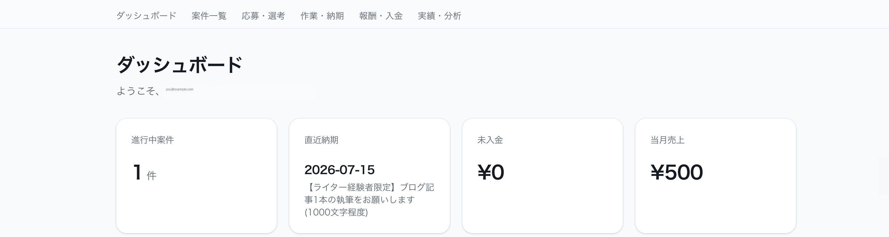

# 案件管理システム（フリーランス向け）

副業Webライターなど、複数のクラウドソーシングサービスを掛け持ちするフリーランス層を対象に、応募〜選考〜作業〜納品〜入金〜振り返りまでを一元管理するWebアプリです。

**公開URL**: https://freelance-job-tracker-five.vercel.app
**要件定義書**: [requirements.md](./requirements.md)



## 誰のためのツールか

クラウドワークスやランサーズなど複数のサービスを利用する副業・フリーランス層は、応募案件・返信状況・面談・納期・報酬・入金状況をそれぞれ別の場所で管理しがちです。その結果、応募先の重複、返信や納期の見落とし、未入金の放置が起こります。本ツールは、案件の発見後から入金・振り返りまでを1つの画面で管理できるようにすることで、この問題を解決します。

## 主な機能（MVP）

- メール＋パスワードによるユーザー登録・ログイン（Supabase Auth）
- 案件の登録・一覧・詳細編集
- 応募状況管理（候補／応募中／面談／契約／不採用）
- 進捗管理（未着手／作業中／確認中／完了）
- 案件一覧の応募状況・納期による絞り込み
- 納品日・納品先URLの記録
- 報酬・入金予定日・入金済みフラグの管理
- 月別売上の自動集計
- 進行中案件数・直近納期・未入金額・当月売上を表示するダッシュボード
- Row Level Securityによるユーザーごとのデータ分離

詳細な機能要件・非機能要件は [requirements.md](./requirements.md) を参照してください。

## 技術スタック

- **フレームワーク**: Next.js 16（App Router, TypeScript, Turbopack）
- **UI**: Tailwind CSS v4 + shadcn/ui（Base UI ベース）
- **認証・DB**: Supabase（Auth + Postgres, Row Level Security）
- **ホスティング**: Vercel
- **バージョン管理**: GitHub（本リポジトリ）

## 使ったClaude Codeの機能

- **CLAUDE.md**: `/init` でプロジェクト固有ルールを生成し、要件定義書を常に参照すること・Plan Mode必須・小さいサイクルでの開発を明記
- **Plan Mode**: アーキテクチャ（DBスキーマ、ルーティング構成、実装サイクルの順序）を設計・提示し、承認を得てから実装を開始
- **`@requirements.md` 参照**: 要件定義書をベースに機能・優先度（MVP/v1.0/v2.0）を決定
- **Gitワークフロー**: 1機能実装 → ブラウザで動作確認 → コミット、の小さいサイクルを繰り返して開発
- **Claude in Chrome**: 実装後に毎回ブラウザで実際に操作し、コンソールエラーの有無まで確認しながら進行

## セットアップ（ローカル開発）

```bash
npm install
cp .env.local.example .env.local  # Supabase の Project URL と anon key を設定
npm run dev
```

Supabase側では `jobs` テーブル（RLS込み）の作成が必要です。SupabaseのSQL Editorで [docs/schema.sql](./docs/schema.sql) の内容を実行してください。

## つまずいたポイント

- **Next.js 16の破壊的変更**: `middleware.ts` が `proxy.ts` にリネームされていた（Next.js 16.0.0〜）。`node_modules/next/dist/docs` 内の同梱ドキュメントを確認して対応。
- **shadcn/uiのBase UI移行**: 使用したshadcn/uiテンプレートがRadixではなくBase UIベースになっており、`asChild` ではなく `render` プロパティでの合成が必要だった。また `Select.Value` は自動でラベルを解決せず、値→表示ラベルの変換関数を明示的に渡す必要があった。
- **Supabaseの新API key体系**: ダッシュボードの表記が従来の「anon key」から「Publishable key」（`sb_publishable_...`）に変わっていた。
- **Emailの確認フロー**: Supabaseプロジェクトはデフォルトでメール確認が有効なため、サインアップ直後はセッションが発行されない。UI側で「確認メールを送信しました」の分岐を実装。

## リンク

- 公開URL: https://freelance-job-tracker-five.vercel.app
- GitHub: https://github.com/shuu112475-afk/freelance-job-tracker
